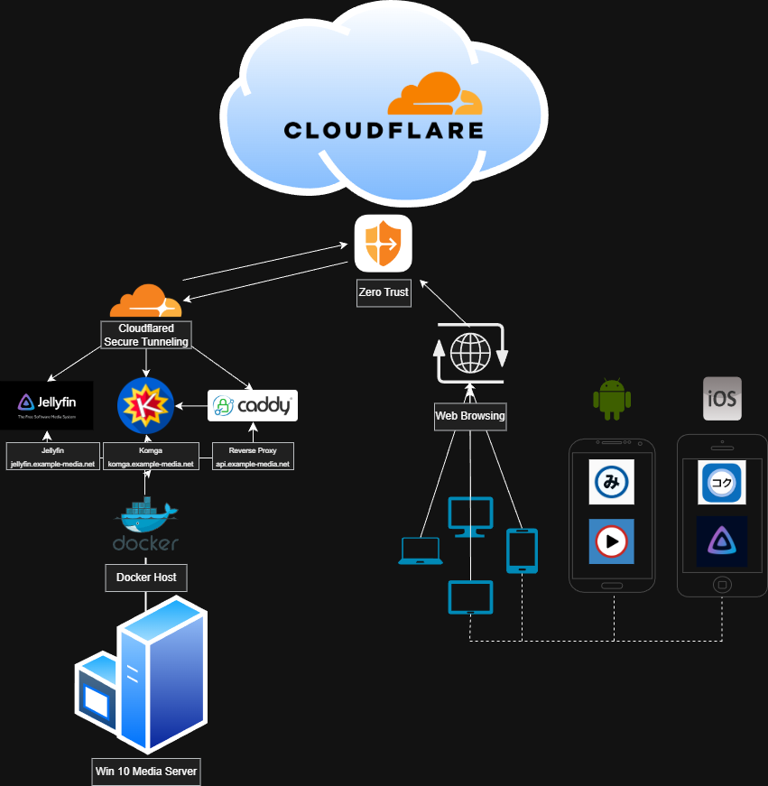

# 🌐 Media Server — Home Lab Infrastructure

  

A fully self-hosted media ecosystem built on top of:

- **Docker** (Jellyfin, Komga, Caddy)
- **Cloudflare Tunnels**
- **Cloudflare Zero Trust**
- **Mobile Clients:** Mihon, Aniyomi, Tachimanga
- **API-Proxy Architecture using Caddy**

This repo documents the entire setup used to provide secure, private, remote media access for yourself and trusted users.

---

# 📦 Components Overview

| Component | Description |
|----------|-------------|
| **Windows 10 Media Server** | Local machine running Docker Desktop |
| **Docker Stack** | Jellyfin, Komga, Caddy Reverse Proxy |
| **Caddy** | TLS termination, API routing, header transforms |
| **Cloudflare Tunnel** | Secure ingress (no exposed ports) |
| **Zero Trust** | OTP-based authentication for all users |
| **Apps** | Mihon (Android), Aniyomi (Android), Tachimanga (iOS) |

---
# 🔒 Security Philosophy

This setup prioritizes **maximum privacy**:

- No ports exposed publicly  
- All traffic goes through **Cloudflare Tunnel**  
- All users must authenticate with **One-Time PIN (OTP) via email**  
- Only approved email addresses can authenticate  
- API-key logic is handled by **Caddy only**  

---

# 📚 Documentation Index

| Topic | File |
|-------|------|
| Docker Stack | [`docker/README.md`](docker/README.md) |
| Caddy Reverse Proxy | [`caddy/README.md`](caddy/README.md) |
| Cloudflare Zero Trust | [`cloudflare/zero-trust-overview.md`](cloudflare/zero-trust-overview.md) |
| Access Policies | [`cloudflare/access-policies.md`](cloudflare/access-policies.md) |
| Tunnel Routes | [`cloudflare/tunnel-routes.md`](cloudflare/tunnel-routes.md) |
| Mobile App Setup Guides | [`clients/`](clients/) |

---

# 📱 Mobile Apps

| App | Platform | Description |
|-----|----------|-------------|
| **Mihon** | Android | Komga reader w/ API key support |
| **Aniyomi** | Android | Anime streaming client (Jellyfin support) |
| **Tachimanga** | iOS | Komga reader using username/password |

Setup guides located in `/clients`.

---
